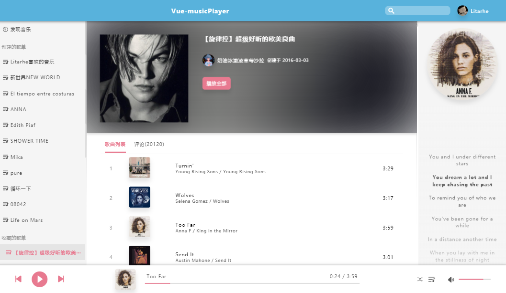
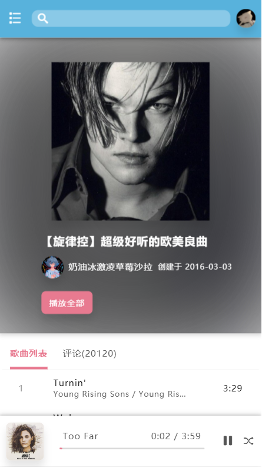

# Vue-musicPlayer

练手项目，pc端和手机端都做了布局，后端接口来自于[NeteaseCloudMusicApi](https://binaryify.github.io/NeteaseCloudMusicApi)

[在线演示](http://162.211.227.77/)

## 功能

- [x] 播放器
- [x] 登录
- [x] 菜单
- [ ] 搜索
- [x] 推荐页
- [x] 歌曲
- [x] 播放记录
- [x] 播放列表
- [x] 评论页
- [x] 歌词页
- [ ] 上一首逻辑
- [ ] 更多页面

## 技术栈

- ***vue, vue-router, vuex*** vue全家桶
- ***sass*** 样式
- ***axios*** 网络请求

## 界面

### PC端



### 手机端



## 更新记录

<details>
<summary>V 1.0.0 (2020.06.19)</summary>

- 手机端pc端窗口适配
- 基本功能实现
- 使用 ***vue, vue-router, vuex***

</details>

## 使用

需在 `.env` 里更改后端接口的地址
```
npm install
npm run serve
```